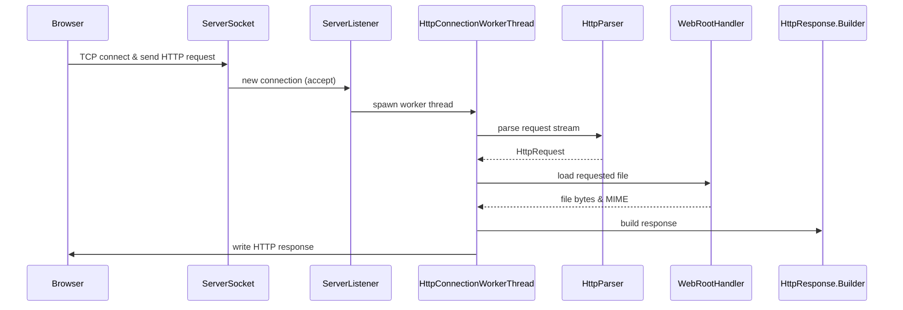

# Java Multithreaded HTTP/1.1 Server

A small HTTP/1.1 server implemented in Java from the ground up. It handles raw TCP sockets, parses requests, and builds compliant responses without using frameworks. The focus is on **correct HTTP semantics** and **code clarity**, with a clean architecture and unit-tested parsing. This project is educational—demonstrating how servers like Tomcat or Netty work internally—rather than aiming for production performance.

## Features

- **HTTP/1.1 Request Parsing:** Manual parsing of start-line and headers, producing an immutable `HttpRequest`. Invalid syntax yields a `400 Bad Request`.
- **Concurrent Handling:** One thread per connection (`ServerSocket` → listener → worker threads). Simple thread-per-connection model (no thread pool) for clarity.
- **Static File Serving:** `WebRootHandler` reads files from the web root, detects MIME types (via file extension), and handles missing files gracefully.
- **Supported Methods:** `GET`, `HEAD` (server *must* support GET/HEAD). Other methods return `501 Not Implemented` or `405 Method Not Allowed`.
- **Response Construction:** Uses a **Builder pattern** for `HttpResponse`, setting version, status, headers, and optional body. Example usage:
  ```java
  HttpResponse res = new HttpResponse.Builder()
      .httpVersion("HTTP/1.1")
      .statusCode(HttpStatusCode.OK)
      .addHeader("Content-Type", "text/html")
      .messageBody("<h1>Hello</h1>".getBytes())
      .build();
  ```  
- **Unit Testing:** JUnit 5 tests for `HttpParser` (valid requests, malformed cases, header parsing, large inputs, etc). Parsing logic is fully decoupled from sockets, allowing fast test coverage of RFC7230 rules.

---

## Architecture



All major components are separated: networking (`ServerSocket`, threads), parsing (`HttpParser`), file I/O (`WebRootHandler`), and response logic (`HttpResponse.Builder`).

---

## Package Structure
Important files listed only
```
src/main/java
├── http
│   ├── HttpParser.java        (parses request line & headers)
│   ├── HttpRequest.java       (immutable request object)
│   ├── HttpResponse.java      (builder for responses)
│   ├── HttpStatusCode.java    (enum of status codes)
│   └── HttpVersion.java       (HTTP version enum)
│
├── httpserver
│   ├── HttpServer.java        (main, opens ServerSocket)
│   ├── ServerListener.java    (accept loop, spawns workers)
│   ├── HttpConnectionWorkerThread.java (handles one request)
│   └── io
│       └── WebRootHandler.java (finds and reads files, MIME)
│
└── test
    └── HttpParserTest.java    (JUnit tests for parsing logic)
```

---

## Component Responsibilities

- **HttpServer:** Listens on a port and starts `ServerListener`. Owning class for the server lifecycle.
- **ServerListener:** In a loop, calls `ServerSocket.accept()`, then immediately creates a new `HttpConnectionWorkerThread` for each client socket. Never processes requests itself, enabling concurrency.
- **HttpConnectionWorkerThread:** Core worker that processes one HTTP request. Its steps:
    1. Read `InputStream` from the client socket.
    2. Invoke `HttpParser.parseHttpRequest(stream)`. On parse error, return **400 Bad Request**.
    3. Inspect `HttpRequest.method`: if `GET`/`HEAD`, call `handleGetRequest()`, else return `501` or `405`.
    4. In `handleGetRequest()`: use `WebRootHandler` to locate the file. If not found, return **404 Not Found**; on I/O error, return **500 Internal Server Error**.
    5. If serving content, set `Content-Type` (MIME) and `Content-Length`; for `HEAD`, omit the body.
    6. Call `.build()` on `HttpResponse.Builder` and write the bytes to `OutputStream`.
    7. **Finally:** close streams and socket in `finally` block to avoid resource leaks (always executed). Catch exceptions to prevent thread crash: on unexpected errors, log and return `500` (don’t throw unchecked).

- **HttpParser:** Reads the request line and headers per RFC7230. It splits the start-line (method, target, version), then reads headers until an empty line. It validates syntax (e.g. proper SP and CRLF). Malformed input leads to throwing a checked exception, handled in the worker. By design, parser **does not depend on networking**, making it easily unit-testable.

- **HttpRequest:** Immutable data class holding method (enum), request-target (path), HTTP version, and headers map. No internal behavior beyond getters. Used by worker to decide routing and response.

- **WebRootHandler:** Takes a request target (URI path) and maps it to a file under a configured web root directory. It checks for path traversal (`../`) and normalizes the path (e.g. using `java.nio.file.Path.normalize()`) to prevent escaping the web root. It returns file bytes and MIME type (e.g. "text/html"). Throws `FileNotFoundException` (404) or `IOException` (500) as needed.

- **HttpResponse.Builder:** Follows the Builder pattern to assemble responses. The builder methods set HTTP version, status code, and headers, then optionally attach a message body (byte array). On `build()`, it serializes the status line, headers, and body into the final byte array. This separation mirrors common frameworks (e.g. Spring, JAX-RS).

---

## Supported Methods & Status Codes

| Method |  Supported? |  
|--------|:-------:|  
| GET    |      ✅  |  
| HEAD   |      ✅  |  
| Others| ❌ (501) |

| Status Code | Meaning                        |
|------------|--------------------------------|
| **200**     | OK (successful request)        |
| **400**     | Bad Request (syntax error)     |
| **404**     | Not Found (file missing)       |
| **405**     | Method Not Allowed (unsupported) |
| **414**     | URI Too Long (target too long) |
| **500**     | Internal Server Error (I/O failure) |
| **501**     | Not Implemented (unsupported method) |

Note: Per HTTP/1.1, servers *must* support GET and HEAD. If a non-GET/HEAD method is received, reply **501**; if a known method is not allowed on this resource, reply **405** and include an `Allow: GET, HEAD` header.

---

## Example HTTP Exchange

**Request:**
```
GET /index.html HTTP/1.1
Host: localhost
User-Agent: curl/8.0
Accept: */*

```

**Response:**
```
HTTP/1.1 200 OK
Content-Type: text/html
Content-Length: 25

<html><body>Home</body></html>
```

---

## Build & Run

Use Maven 

- **Maven:**
  ```bash
  mvn clean package
  java -jar target/http-server.jar 8080  # port as arg
  ```  
  Run tests: `mvn test`.

On startup, the server listens on the specified port (default 8080 if none given) and serves files from `src/main/resources/webroot` (configurable).

---

## Testing

JUnit 5 is used. Key tests include:

- **HttpParserTest:** Parses valid request lines and headers (including CRLF-only lines), and asserts failures on malformed inputs (missing parts, bad characters).
- **HeaderParserTest:** Edge cases for header fields, folded headers, and large number of headers.

Because `HttpParser` is separate from sockets, tests use a `ByteArrayInputStream` to feed raw HTTP strings. This ensures full coverage of the parsing logic against RFC7230 rules.

---

## Design Decisions

- **Thread-per-Connection:** Chosen for simplicity and clarity. Each client gets a dedicated `Thread`. This is easy to implement and understand, but does not scale to thousands of connections (no thread pool or async). Future improvements could include a fixed thread pool or non-blocking I/O (NIO).
- **Builder Pattern:** Enables clean assembly of responses. It prevents partial construction errors and separates header/body logic.
- **Separation of Concerns:** Parsing, networking, and file I/O are distinct components. This makes the codebase easier to maintain and test (e.g. the parser can be tested without opening sockets).
- **HTTP Compliance:** Returns correct status codes per RFC7231/7230 (e.g. 400 on malformed requests, 501/405 for methods). GET/HEAD support is guaranteed.
- **Unit Testing:** Emphasized testing the parser in isolation (using JUnit 5) to ensure request lines and headers follow HTTP spec. This yields confidence in request handling.

---

## Best Practices & Security

- **Resource Cleanup:** All `Socket` streams are closed in `finally` blocks to avoid leaks. Uncaught exceptions in workers are caught and logged; the server thread keeps running.
- **Input Validation:** Request targets are normalized to prevent directory traversal. Reject targets with `../` or empty paths. (E.g. using `Paths.get().normalize()`).
- **Timeouts:** It’s advisable to set `ServerSocket.setSoTimeout(...)` to avoid hanging on accept/read. Similarly, limit the maximum header/request size.
- **Error Handling:** Don’t expose stack traces to clients. Return appropriate HTTP errors (400, 404, 500) instead of raw exceptions.
- **No Directory Listing:** By default, do not allow browsing directories; only serve files. Return 404 if the target is a directory without an index file.

---

## Troubleshooting

- **Port in Use:** “Address already in use” means the port is occupied. Try a different port or kill the existing process.
- **Missing Files:** A 404 means the file under `webroot` was not found. Check the path and web root directory.
- **Long Requests:** If the server hangs on a client, consider increasing socket timeout or client read timeout.
- **Unsupported Method:** Seeing 501? The server only supports GET/HEAD. Try a supported method.

---

**References:** HTTP/1.1 RFC 7230/7231 semantics